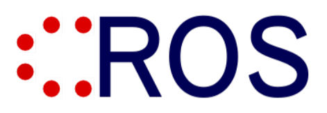

# cROS 0.9 with Service-Call Support

cROS is a library written in stadard c-language that provides a single thread
implementation of the  basic features required to implement a ROS
(Robot Operating System) node.
This ROS node supports the concurrent operation as several:
 * Topic subscribers
 * Topic Publishers
 * Service providers (servers)
 * Service callers (clients)
 * Parameter subscribers

### Requirements

cROS runs on a base Linux distribution with:
 * The GCC compiler
 * CMake 2.6 or later
 * (Optional) Doxygen

### Build cROS

cROS uses CMake the cross platform build system. To create a build directory
an compile the project, type the following commands in a terminal starting
from the source root directory:

```bash
$ mkdir build
$ cd build
$ cmake ..
$ make
```

You will find a static library (*libcros.a*) inside the *build/lib* directory, and
some test executables that  makes use of the libcros library inside the
*build/bin* directory. The entrypoint sample to learn how to use cROS is
*samples/ros_api.c*, which shows a non trivial example of a ROS node with
publishers/subcribers and calls to ROS services.

If you want to build the create the library documentation, type: (you'll need
Doxygen)

```bash
$ make docs
```

You'll find the html documentation inside the *docs/html* directory. To browse
the documentation, open with a web browser the index.html file.

### Licensing

cROS is licensed under the BSD license. For more
licensing options and for paid support please write an email to cros@it-robotics.it.
